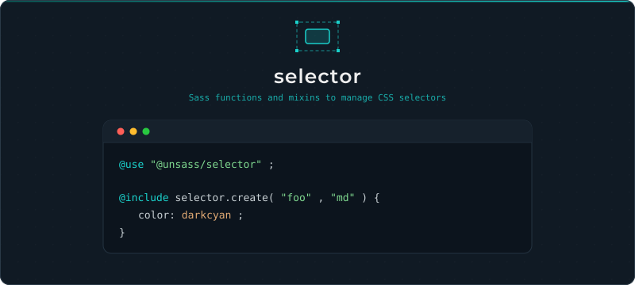

# Selector

[](https://www.npmjs.com/package/@unsass/selector)
[](https://www.npmjs.com/package/@unsass/selector)
[](https://www.npmjs.com/package/@unsass/selector)

## Introduction

Sass functions and mixins to manage CSS selectors.

<div align="center">



</div>

## Installing

```shell
npm install @unsass/selector
```

## Usage

```scss
@use "@unsass/selector";

@include selector.create("foo", "md") {
    color: darkcyan;
}
```

```css
.md\:foo {
    color: darkcyan;
}
```

## Mixins

### `create($selector, $scope, $separator, $suffix, $pseudo-class, $pseudo-element, $root)`

Builds a class selector from a name, with optional scope, separator, pseudo and `@at-root` options.

| Parameter         | Description                                                | Default |
|-------------------|------------------------------------------------------------|---------|
| `$selector`       | Selector name (a leading `.` is stripped).                 | —       |
| `$scope`          | Scope affix value, as a single token or a list of tokens.  | `null`  |
| `$separator`      | Scope affix separator.                                     | `":"`   |
| `$suffix`         | Append the scope as a suffix instead of a prefix.          | `false` |
| `$pseudo-class`   | Pseudo-class appended to the selector.                     | `null`  |
| `$pseudo-element` | Pseudo-element appended to the selector.                   | `null`  |
| `$root`           | Wrap the output in an `@at-root` rule.                     | `false` |

```scss
@use "@unsass/selector";

@include selector.create("foo", "md") {
    color: darkcyan;
}
```

```css
.md\:foo {
    color: darkcyan;
}
```

#### `$scope`

Pass a list to chain several scope tokens.

```scss
@use "@unsass/selector";

@include selector.create("foo", ("md", "lg")) {
    color: darkcyan;
}
```

```css
.md\:lg\:foo {
    color: darkcyan;
}
```

#### `$separator`

Define your own scope separator character.

```scss
@use "@unsass/selector";

@include selector.create("foo", "md", "@") {
    color: darkcyan;
}
```

```css
.md\@foo {
    color: darkcyan;
}
```

#### `$suffix`

Append the scope value as a suffix on the selector.

```scss
@use "@unsass/selector";

@include selector.create("foo", "md", $suffix: true) {
    color: darkcyan;
}
```

```css
.foo\:md {
    color: darkcyan;
}
```

#### `$pseudo-class`

Define the pseudo-class suffix.

```scss
@use "@unsass/selector";

@include selector.create("foo", "hover", $pseudo-class: "hover") {
    color: darkcyan;
}
```

```css
.hover\:foo:hover {
    color: darkcyan;
}
```

#### `$pseudo-element`

Define the pseudo-element suffix.

```scss
@use "@unsass/selector";

@include selector.create("foo", "before", $pseudo-element: "before") {
    color: darkcyan;
}
```

```css
.before\:foo::before {
    color: darkcyan;
}
```

#### `$root`

Wrap the selector with an `@at-root` rule before code output.

```scss
@use "@unsass/selector";

.foo {
    .bar {
        @include selector.create(&, "md", $root: true) {
            color: darkcyan;
        }
    }
}
```

```css
.md\:foo .bar {
    color: darkcyan;
}
```

### `media($args)`

Wraps the content in a `@media` rule.

```scss
@use "@unsass/selector";

.foo {
    @include selector.media("screen") {
        color: darkcyan;
    }
}
```

```css
@media screen {
    .foo {
        color: darkcyan;
    }
}
```

## Functions

### `to-class($selector)`

Returns a class selector from a name.

```scss
@use "@unsass/selector";

$selector: selector.to-class("foo"); // ".foo"
```

### `to-id($selector)`

Returns an id selector from a name.

```scss
@use "@unsass/selector";

$selector: selector.to-id("foo"); // "#foo"
```

### `pseudo-class($selector, $pseudo-class)`

Appends a pseudo-class to a selector.

```scss
@use "@unsass/selector";

$selector: selector.pseudo-class(".foo", "hover"); // ".foo:hover"
```

### `pseudo-element($selector, $pseudo-element)`

Appends a pseudo-element to a selector.

```scss
@use "@unsass/selector";

$selector: selector.pseudo-element(".foo", "before"); // ".foo::before"
```
